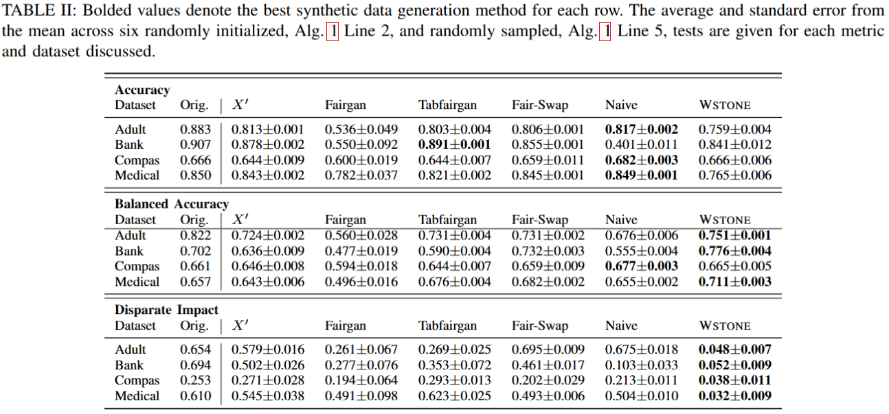

# WhetStone

## To Run Whetstone
`cd Whetstone`\
`docker build -t whetstone .`\
`docker run -it whetstone:latest /bin/bash`\
Inside of Docker Container\
`python main-ablation.py [directory] [data_name] [training_file] [protected] [privileged] [predicted] [preferred]`\
[directory]: the directory containing the synthetically generated data files
[data_name]: name of this test run
[training_file]: real data file
[protected]: protected feature
[privileged]: protected feature privileged value
[predicted]: predicted feature
[preferred]: predicted feature preferred value

## Example
`python main-ablation.py ../gan_data/compas/compas-pro-VGAN-1hot-norm-split-valid-best/9/ test_name real_data/propublica-compas/PROPUBLICA-COMPAS-SPLIT-VALID-20 race Caucasian two_year_recid 0`

## To Run With Specific Hyperparameter Test Values
`python main-ablation.py [directory] [data_name] [training_file] [protected] [privileged] [predicted] [preferred] [-b/-sp/-p/-a/-n/-t] [hyperparameter value]`
* -b: beta
* -sp: set percent
* -p: select percent
* -a: minimum accuracy bound
* -n: available percentage of data points to select from
* -t: number of samples to test each round

Examples can be found in Whetstone/project/ablation_study/main-ablation-test.sh

# Methods Compared With

## Original
Original Datasets From: https://github.com/Trusted-AI/AIF360/tree/main/aif360/datasets \
Datasets Split Into Train/Val/Test Found in Whetstone/real_data

## GAN Repository Used to Generate Synthetic Data (X')
https://github.com/ruclty/Daisy \
Generated Data Found in Whetstone/gan_data

## FairGAN
`cd Daisy-Edited` \
python Daisy/run.py [parameter file] 
Generated Data Found in Whetstone/project/FAIRGAN
### Example
python Daisy/run.py param-short.json \

## TabFairGAN
Steps found in the TabFairGAN README.md \
Generated Data Found in Whetstone/project/TABFAIRGAN

## FairSwap
Inside of Docker container \
`python fair-swap.py [directory] [data_name] [training_file] [protected] [privileged] [predicted] [preferred]` \
Generated Data Found in Whetstone/project/FAIR_SWAP

## Naive
Inside of Docker container \
`python main-naive.py [directory] [data_name] [training_file] [protected] [privileged] [predicted] [preferred]` \
Generated Data Found in Whetstone/project/ablation_study/ablation_study_data/ablation_study_NAIVE2

# Testing the Resultant Datasets
`python testing-metrics.py [dataset] [protected]` \
[dataset] and [protected] should be present in the `get_og_file` function

